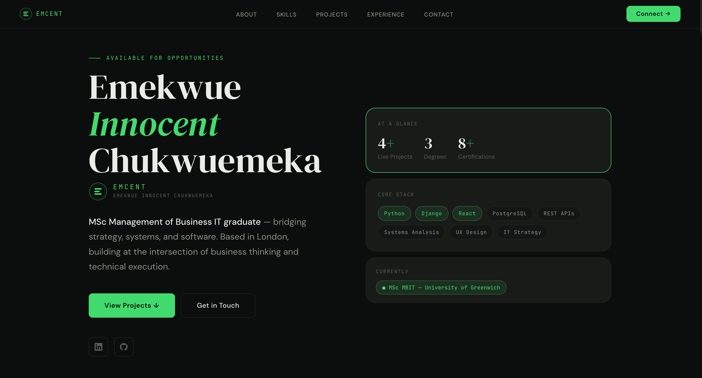
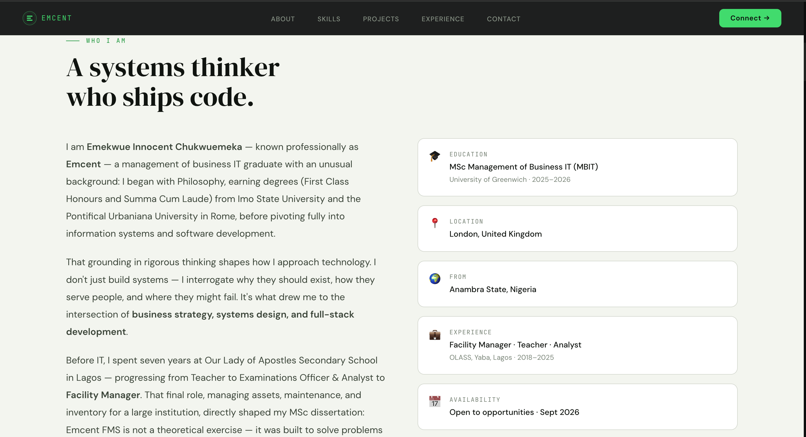
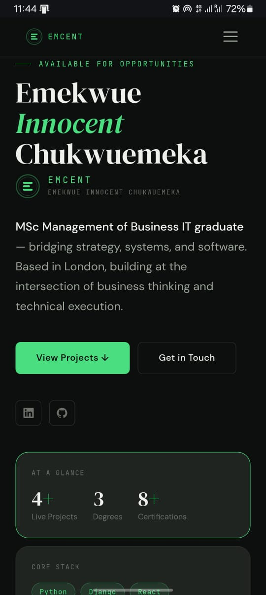

# Emcent — Portfolio Website

> **Emekwue Innocent Chukwuemeka** · MSc Business IT Management · London  
> Live at **[emcent.dev](https://emcent.dev)**

A personal portfolio built with React, Vite, and Tailwind CSS — designed to present a hybrid profile spanning software engineering, systems analysis, UX design, and IT management.

---

## Live Demo

🌐 **[emcent.dev](https://emcent.dev)**

---

## Screenshots

### Desktop





### Mobile



---

## Tech Stack

| Layer | Technology |
|---|---|
| Frontend Framework | React 18 + Vite |
| Styling | Tailwind CSS v3 |
| Language | JavaScript (JSX) |
| Contact Form | Formspree |
| Deployment | Vercel |
| Domain | Cloudflare (emcent.dev) |
| Email | Cloudflare Email Routing |

---

## Features

- **Dark theme** with emerald green accent throughout
- **Light/cream alternating sections** — About, Projects, Contact
- **Responsive design** — mobile-first with right-side drawer navigation
- **Emcent monogram** — custom SVG brand mark used as favicon and nav logo
- **Professional certifications** — Google, Meta, Microsoft, LinkedIn, Univelcity with brand logos
- **Working contact form** — Formspree integration forwarding to innocent@emcent.dev
- **Custom domain** — emcent.dev with SSL via Cloudflare

---

## Project Structure

src/
├── components/
│   ├── nav/         Nav.jsx           — Responsive navigation with mobile drawer
│   ├── hero/        Hero.jsx          — Landing section with stat cards
│   ├── about/       About.jsx         — Bio and detail cards (light theme)
│   ├── skills/      Skills.jsx        — Competency groups and certifications
│   ├── projects/    Projects.jsx      — Project cards (light theme)
│   ├── experience/  Experience.jsx    — Education and work timeline
│   ├── contact/     Contact.jsx       — Contact form and links (light theme)
│   ├── footer/      Footer.jsx        — Footer with monogram
│   └── ui/
│       ├── Monogram.jsx              — SVG E lettermark component
│       ├── Divider.jsx               — Section divider
│       └── CertLogos.jsx             — Brand SVG logos for certifications
├── data/
│   └── index.js                      — All portfolio content (single source of truth)
├── hooks/
│   └── useTheme.js                   — Dark/light theme hook
├── App.jsx                           — Root component
├── main.jsx                          — Entry point
└── index.css                         — Global styles and CSS variables

---

## Content Updates

All portfolio content lives in **`src/data/index.js`**.  
To update projects, certifications, experience, or personal details — edit that file only.  
No component code needs to change.

---

## Local Development

```bash
# Clone the repository
git clone https://github.com/CodeEmcent/emcent-portfolio.git
cd emcent-portfolio

# Install dependencies
npm install

# Start development server
npm run dev
```

Open [http://localhost:5173](http://localhost:5173) in your browser.

---

## Deployment

The portfolio deploys automatically to Vercel on every push to `main`.

```bash
# Build for production
npm run build

# Preview production build locally
npm run preview
```

**Environment setup:**
1. Connect repo to [Vercel](https://vercel.com) — auto-detects Vite
2. Add custom domain in Vercel → Settings → Domains
3. Update DNS records in Cloudflare to point to Vercel
4. Replace `YOUR_FORM_ID` in `src/data/index.js` with your Formspree form ID

---

## Favicon

All favicon files are in `/public`:

| File | Purpose |
|---|---|
| `favicon.svg` | Modern browsers (scalable) |
| `favicon.ico` | Universal fallback |
| `apple-touch-icon.png` | iPhone/iPad home screen (180×180) |
| `favicon-192.png` | Android home screen (192×192) |

---

## Licence

This portfolio is personal and not open for reuse.  
© 2026 Emekwue Innocent Chukwuemeka — All rights reserved.